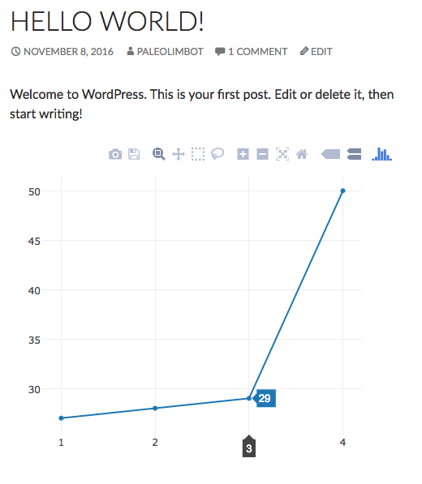

# Plot.wp

Add JSON-based plots to posts and pages using the [plotly](https://plot.ly/javascript/) API

## Installation

Install **Plot.wp** from the Wordpress Codex or from the releases page. Unzip the folder into your `plugins` directory and start using the `[plotly]...[/plotly]` shortcode!

## The plotly shortcode

The plot.wp plugin works by taking whatever is between the `[plotly]` and `[/plotly]`, converting it to JSON, and passing it to `Plotly.plot('plotlydiv', {...})`.

```
[plotly]
{
  "data": [{
    "x": [1, 2, 3, 4],
    "y": [27, 28, 29, 50],
    "mode": "lines+markers",
    "type": "scatter"
  }],
  "layout": {
    "margin": {
      "t": 40, "r": 40, "b": 40, "l":40
    }
  }
}
[/plotly]
```



You can also set attributes of the enclosing `div` by passing these to the shortcode in the form `[plotly style="height: 200px"]...[/plotly]`. Default settings are controlled by the `defaultplot.css` stylesheet, although this behaviour may be migrated to a settings page in the future.

## How to use the plotly.js API

The [plotly.js](https://plot.ly/javascript/) API is a powerful plotting library capable of many complex plots. Note that there is one small difference between the documentation and the `[plotly]...[/plotly]` shortcode, and that is that the content of `[plotly]...[/plotly]` must be valid JSON. This is mostly to catch typing errors and may be changed in a future version. Plot.ly has APIs for other languages such as R and Python, and these libraries are capable of producing valid JSON that can be used within the shortcode. For example, in R:

```r
library(plotly)
ggplot(...)
plotly:::to_JSON(plotly_build(ggplot2::last_plot())$x)
```

This doesn't tend to produce very pretty plots, but will get the job done and provides a decent example of how to do complex plotting.